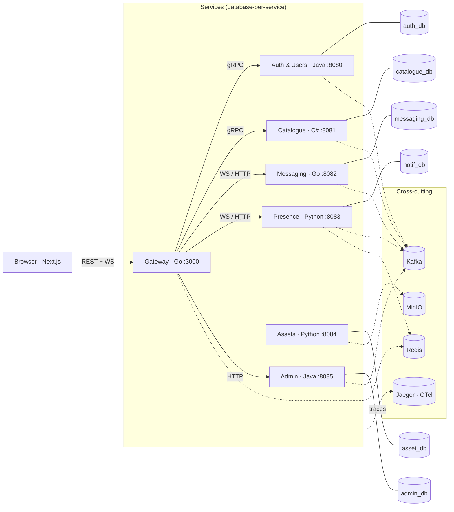

# openmarket-corpo


Polyglot microservices rebuild of the **OpenMarket** marketplace concept — a
greenfield distributed-systems capstone. The product is the same (an in-game
item trading marketplace with chat, reputation and moderation); the architecture
is the point. Every backend service is a different enterprise/legacy stack —
deliberately not TypeScript — talking over language-neutral wire protocols.

> Detailed design docs (concept, roadmap, workplan) live in the Obsidian vault:
> `projects/openmarket-v2/`. This README is the recruiter-facing summary.

---

## What is OpenMarket?

OpenMarket is an item-trading marketplace (think in-game economies): users list
items for trade, make multi-item offers, chat with each other, build reputation
through reviews/trust scores, and are kept in line by an admin/moderation team.
The original (**v1**) is a TypeScript monolith (SvelteKit + Elysia + Drizzle),
live and working.

**v2** reuses the concept and domain but is a **from-scratch rebuild** as a
distributed system, so that each service genuinely owns its data, talks over
Kafka events, and is traceable across languages. v1 stays live during the whole
build; v2 ships its own live URL.

## Why polyglot?

- Every service is a different language a real enterprise actually runs: **Go,
  Java (Spring Boot), C#, Python (FastAPI)** — no more "another JS library".
- It forces real distributed-systems learning: contract-first coordination,
  database-per-service, Kafka eventing, OpenTelemetry tracing, stateless
  scaling.
- FastAPI is the learning vehicle for Python (presence + assets skeletons pulled
  early in Phase 0). TypeScript is confined to the Next.js frontend, which only
  ever talks to the Go gateway.

## Architecture (database-per-service)

| Service | Lang / Stack | Store | Responsibility |
|---------|-------------|-------|----------------|
| API Gateway / BFF | Go | — | Public entry, WS termination, JWT session check, rate limit, routing, UI-shaped DTO aggregation |
| Auth & Users | Java Spring Boot | `auth_db` | Discord OAuth + email/password, JWT issue, RBAC (4 roles / 38 perms), bans/warnings, profiles, reviews + trust score |
| Catalogue & Listings | C# ASP.NET Core | `catalogue_db` | Items, currencies, categories, listings, multi-item offers, trades, search, watchlist, expiry scheduler |
| Messaging (chat) | Go | `messaging_db` | Conversations, messages, typing indicators, unread tracking, per-conversation WS fan-in/out |
| Presence & Notifications | Python FastAPI | `notif_db` + Redis | Online status, WS fan-out (Redis pub/sub), 7 notification types |
| Assets & Images | Python FastAPI | `asset_db` + **MinIO** (S3-compatible) | Uploads, resize/WebP (Pillow), OG previews, media library |
| Admin & Moderation | Java Spring Boot | `admin_db` | Reports (CRUD/resolve), audit log, site config/theme, analytics ingestion + admin insights |

Cross-cutting: **Kafka** (events, KRaft) + **Schema Registry** (protobuf event
contracts), **Redis** (presence + cache + rate-limit), **OpenTelemetry** (traces
→ Jaeger, metrics → Prometheus), **PostgreSQL 17** (one instance, one DB per
service). Locally: Docker Compose. Stretch: Kubernetes + Strimzi.



*Auth & Users is the reference implementation — deep-dive docs in
[`services/auth/docs/`](services/auth/docs/README.md). The rest are scaffolded
services moving down the same [roadmap](#status).*

### How services talk

Languages never call each other in-process — they communicate over the network
with language-neutral protocols:

| Caller | Callee | Protocol | Format |
|--------|--------|----------|--------|
| Browser | Gateway | REST + WS | JSON |
| Gateway | Auth / Catalogue / Admin | **gRPC** (HTTP/2) | protobuf — **live for auth** (`IntrospectToken`, the gateway's edge check); catalogue/admin pending |
| Gateway | Messaging / Presence | WS / HTTP | JSON |
| Messaging | Kafka | publish | protobuf |
| Presence / Admin | Kafka | subscribe | protobuf |
| All services | Docker / K8s probes | HTTP | — |

The gateway is the **only** public entry point: it terminates WebSockets, fans
out events, and shapes per-service data into UI-ready DTOs. The frontend never
sees a database schema or does a cross-service join — that's the BFF pattern.

A shared W3C `traceparent` trace ID rides every hop into Jaeger, so one chat
message is one trace across Go, Python, and the gateway.

### Eventing (Kafka)

Producers/consumers and partitioning are baked into service code, so the broker
is a blocking, decided-up-front choice. Topics include `user.created`,
`user.banned`, `listing.created`, `listing.sold`, `listing.expired`,
`message.created`, `review.created`, `report.created`, `report.resolved`,
`user.deleted`. Event + gRPC contracts are defined as `.proto` schemas
(`contracts/`), with a Schema Registry as the language-neutral replacement for
v1's compile-time type chain.

### Locked-in distributed-systems decisions

- **Stateless JWT sessions**, not DB sessions — gateway validates signatures;
  revocation via a Redis blocklist fed by `user.banned`.
- **Contract-first**: OpenAPI (REST) + protobuf event schemas + Schema Registry.
- **No cross-service DB reads** — data is owned, never borrowed; services keep
  local projections from events.
- **Eventual consistency + idempotent consumers** — e.g. GDPR account deletion
  is a `user.deleted` saga; trust scores update by consuming `listing.sold`.
- **Outbox pattern** — services that write to Postgres and publish to Kafka use
  an outbox table + relay so the two are atomic.
- **Idempotency keys** — HTTP mutations (create listing, send message) accept an
  idempotency key so retries never duplicate work.

## Platform / distributed-systems patterns

Beyond the domain services, this project is also a vehicle for the
infrastructure/cross-cutting patterns that make microservices production-shaped:

| Pattern | Why | Fit |
|---------|-----|-----|
| **gRPC (internal)** | Strongly typed, efficient gateway→service calls; reuses the same `.proto` schemas as Kafka events. | Gateway → services |
| **Outbox pattern** | Makes "write DB + publish event" atomic — no lost events on crash. | Any event publisher |
| **Schema Registry** | Versioned, enforced protobuf event contracts. | Kafka event layer |
| **Idempotency keys** | Safe retries for POST/PUT mutations. | Gateway mutations |
| **Testcontainers** | Integration tests against real Postgres/Kafka/Redis. | Every service test suite |
| **MinIO / S3** | Real object storage for images instead of a local volume. | Assets service |
| **Pact (contract tests)** | Catches gateway/service contract drift before deploy. | Gateway ↔ each service |

These are introduced after the core feature flows work — they are the "infra
fast-follow" that turns a demo into a credible system.

## Status

**Phase 0 — foundations: done.** Monorepo scaffold, infra (Postgres, Kafka,
Redis, Jaeger), all 7 service skeletons with `/health/live` + `/health/ready`
and Dockerfiles, CI matrix across all four languages, weekly OWASP
dependency scan.

**Phase 1 — Auth & Users: the reference implementation.** Discord OAuth +
email/password, RS256 JWT with JWKS, rotating refresh-token families with
theft detection, RBAC (4 roles / 38 permissions), bans/warnings with rank
guards, GDPR export/erase, email flows, session management. Shipped through a
full OWASP-grounded security audit with every finding remediated
(see [`services/auth/docs/security.md`](services/auth/docs/security.md)).

### How it's verified

| Level | What | Where |
|-------|------|-------|
| Unit + contract | 201 tests pinning behavior, envelopes, and security edges | `mvn test` (CI on every push) |
| End-to-end | 126-step flow test against real Postgres + fake Discord: register → verify → OAuth → ban → roles → erase → delete — §14 runs the last steps **through the gateway** | `services/auth/scripts/flow-test.sh` |
| Container | Non-root image, persisted signing key, writable key volume | `deploy/compose` |
| Supply chain | Weekly OWASP dependency-check (CVSS 9 gate) | CI, advisory |
| Hygiene | `make test` / `make lint` run all four languages from one command | root `Makefile` |

### Roadmap

- **Phase 0** — Contracts, Kafka, OTel baseline, 7 skeletons ✅
- **Phase 1** — Auth (Java) + Catalogue (C#) through Gateway (Go): auth sync
  calls go internal gRPC from the start (no REST-proxy stage); catalogue stays
  REST until its slice migrates *(auth shipped & audited; **gateway live** —
  REST proxying + gRPC edge auth, see [gateway README](services/gateway/README.md);
  catalogue next)*
- **Phase 2** — Messaging (Go) + Presence/Notifications (Python) over WS — full
  chat flow traced
- **Phase 3** — Fill the domain: reputation, assets/images, admin/moderation,
  GDPR saga
- **Phase 4** — Infra fast-follow: remaining internal gRPC (catalogue + admin;
  auth already speaks it), outbox relay, Schema Registry,
  idempotency keys, Testcontainers, MinIO, Pact, LB/replicas, PGBouncer, read
  replica, Prometheus/Grafana, Loki, CI/CD, resilience
- **Phase 5** — Kubernetes + Strimzi (kind)
- **Phase 6** — Polish: screenshots, 30-second concepts per service, CV

Milestones: M1 foundations → M2 auth+catalogue → **M3 first live URL** → M4
infra → M5 K8s → M6 polish.

## Quick start

```bash
make infra-up      # postgres, kafka, redis, jaeger
make build         # build all 7 services
make up            # everything running
```

Or directly:

```bash
docker compose -f deploy/compose/docker-compose.yml up --build
```

Gateway: `http://localhost:3000` · Jaeger UI: `http://localhost:16686`

Run a single service locally (see `DEV.md` for details):

```bash
make postgres
make auth          # Spring Boot on :8080
make gateway       # Go on :3000
make presence      # Python FastAPI on :8083
```

## Repo layout

```
├── services/          # 7 services (gateway, auth, catalogue, messaging, presence, assets, admin)
├── contracts/         # .proto event schemas + OpenAPI specs + gRPC service definitions
├── deploy/
│   ├── compose/       # docker-compose.yml + init SQL (6 DBs)
│   └── k8s/           # kustomize manifests (Phase 5)
├── frontend/          # Next.js app (v1 SvelteKit patterns, ported to React)
├── docs/
│   └── ARCHITECTURE.md # detailed architecture decisions
├── Makefile           # one command per service / infra
└── DEV.md             # local development guide
```

## License / status

Learning capstone project. Not affiliated with any existing marketplace.